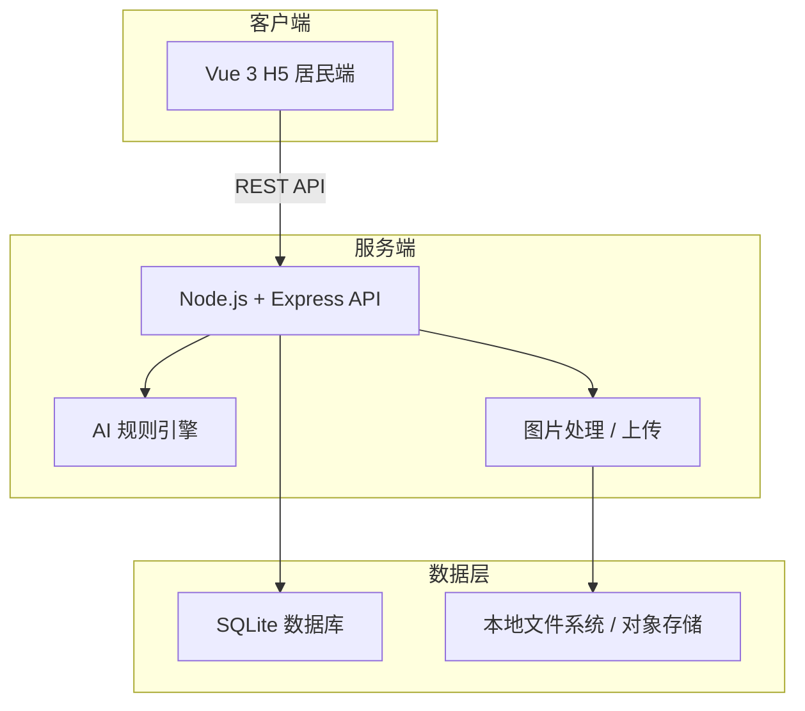
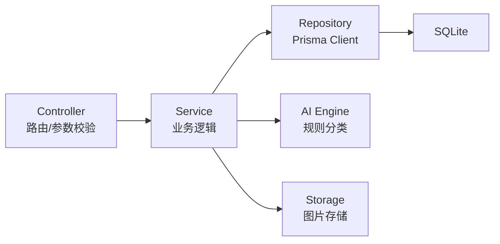
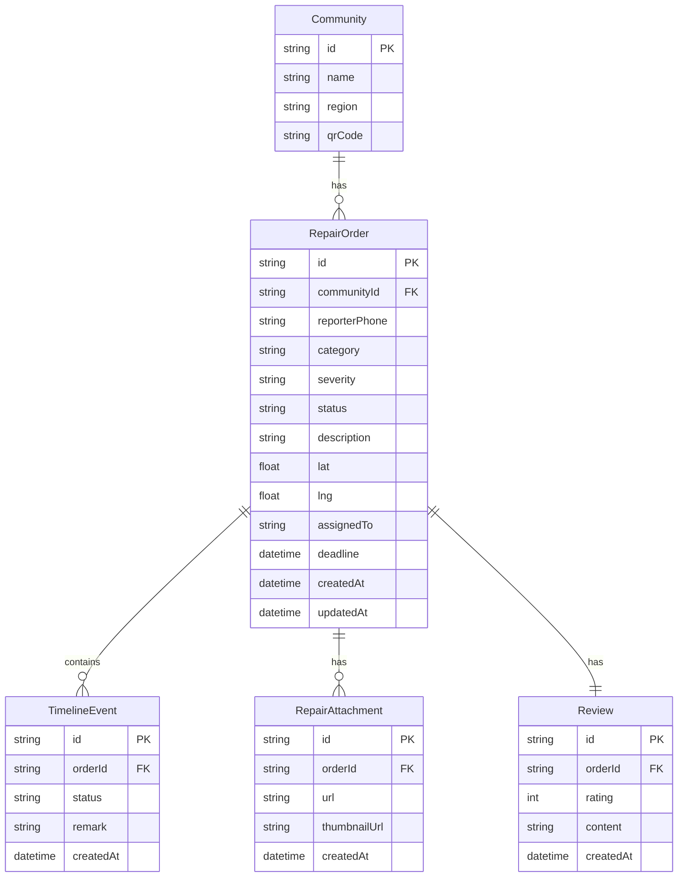

# 修哪儿 H5 Demo 技术架构文档

## 1. 架构设计



## 2. 技术描述
- **前端**：Vue 3.4 + TypeScript 5 + Vite 5 + Vue Router 4 + Pinia 2 + Tailwind CSS 3
- **初始化工具**：`npm create vue@latest`
- **后端**：Node.js 20 LTS + Express 4 + TypeScript 5
- **ORM**：Prisma 5 + SQLite
- **AI 识别**：Demo 阶段使用轻量规则引擎（基于关键词与图片元数据模拟分类与严重度），后续可替换为真实 AI 服务
- **图片存储**：Demo 阶段存本地 `uploads/` 目录，生产环境可替换为腾讯云 COS / 阿里云 OSS
- **实时通知**：Demo 阶段使用短轮询（5 秒一次）模拟实时更新，后续可升级为 WebSocket

## 3. 路由定义

| 路由 | 用途 |
|------|------|
| `/` | 首页：社区入口与流程介绍 |
| `/report` | 报修页：拍照、AI 识别、提交工单 |
| `/track/:orderId` | 进度追踪页：快递式时间线与评价 |
| `/my-orders` | 我的报修列表页 |

## 4. API 定义

### 4.1 创建报修工单
```typescript
POST /api/repair-orders
Request: {
  communityId: string;
  reporterPhone: string;
  images: string[];        // 上传后的图片 URL
  description: string;
  location?: { lat: number; lng: number };
}
Response: {
  code: 0;
  data: {
    orderId: string;
    category: string;
    severity: 'general' | 'urgent' | 'critical';
    status: 'submitted';
    createdAt: string;
  };
}
```

### 4.2 查询工单详情
```typescript
GET /api/repair-orders/:orderId
Response: {
  code: 0;
  data: RepairOrder & { timeline: TimelineEvent[] };
}
```

### 4.3 更新工单状态（模拟物业/维修人员）
```typescript
PATCH /api/repair-orders/:orderId/status
Request: {
  status: 'accepted' | 'processing' | 'pending_review' | 'completed';
  remark?: string;
}
```

### 4.4 提交评价
```typescript
POST /api/repair-orders/:orderId/review
Request: {
  rating: number;   // 1-5
  content?: string;
}
```

### 4.5 查询我的报修列表
```typescript
GET /api/repair-orders?phone=13800138000&status=&page=1&pageSize=10
```

## 5. 服务端架构图



## 6. 数据模型

### 6.1 数据模型定义



### 6.2 数据定义语言

```sql
CREATE TABLE Community (
    id TEXT PRIMARY KEY,
    name TEXT NOT NULL,
    region TEXT NOT NULL,
    qrCode TEXT
);

CREATE TABLE RepairOrder (
    id TEXT PRIMARY KEY,
    communityId TEXT NOT NULL,
    reporterPhone TEXT NOT NULL,
    category TEXT NOT NULL,
    severity TEXT NOT NULL CHECK(severity IN ('general', 'urgent', 'critical')),
    status TEXT NOT NULL CHECK(status IN ('submitted', 'accepted', 'processing', 'pending_review', 'completed', 'escalated')),
    description TEXT,
    lat REAL,
    lng REAL,
    assignedTo TEXT,
    deadline DATETIME,
    createdAt DATETIME DEFAULT CURRENT_TIMESTAMP,
    updatedAt DATETIME DEFAULT CURRENT_TIMESTAMP,
    FOREIGN KEY (communityId) REFERENCES Community(id)
);

CREATE TABLE TimelineEvent (
    id TEXT PRIMARY KEY,
    orderId TEXT NOT NULL,
    status TEXT NOT NULL,
    remark TEXT,
    createdAt DATETIME DEFAULT CURRENT_TIMESTAMP,
    FOREIGN KEY (orderId) REFERENCES RepairOrder(id)
);

CREATE TABLE RepairAttachment (
    id TEXT PRIMARY KEY,
    orderId TEXT NOT NULL,
    url TEXT NOT NULL,
    thumbnailUrl TEXT,
    createdAt DATETIME DEFAULT CURRENT_TIMESTAMP,
    FOREIGN KEY (orderId) REFERENCES RepairOrder(id)
);

CREATE TABLE Review (
    id TEXT PRIMARY KEY,
    orderId TEXT NOT NULL UNIQUE,
    rating INTEGER NOT NULL CHECK(rating BETWEEN 1 AND 5),
    content TEXT,
    createdAt DATETIME DEFAULT CURRENT_TIMESTAMP,
    FOREIGN KEY (orderId) REFERENCES RepairOrder(id)
);

-- 初始数据
INSERT INTO Community (id, name, region, qrCode) VALUES
('demo-community', '阳光花园小区', '北京市朝阳区', '');
```
