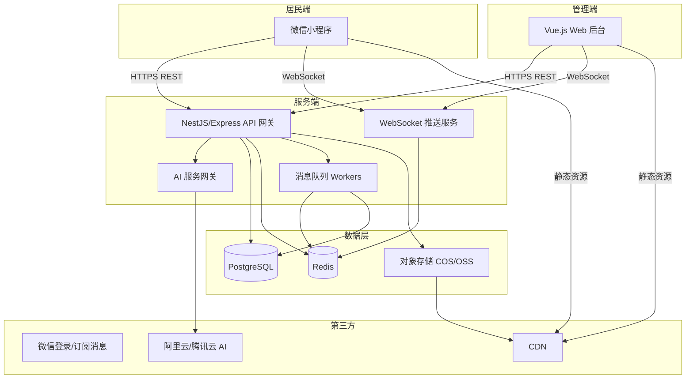
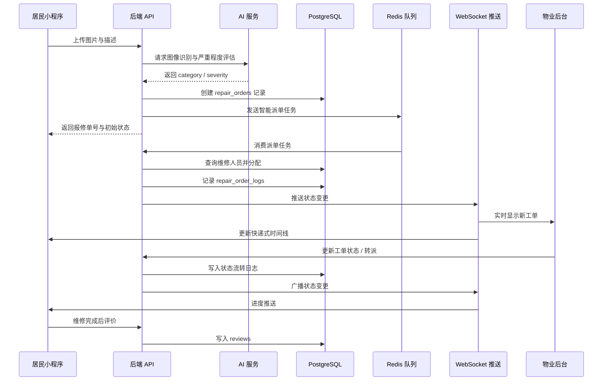

# 修哪儿 — 技术架构方案

> 像查快递一样查报修：为 MVP 快速启动而设计的技术架构。

## 1. 前端技术栈

### 1.1 居民端：微信小程序原生框架

| 层级 | 选型 | 说明 |
|------|------|------|
| 框架 | 微信小程序原生框架 | 零额外依赖，包体积小，微信生态能力（登录、订阅消息、扫码、定位）集成最原生 |
| 样式 | WXSS + CSS Variables | 统一主题色与间距变量，便于后续换肤 |
| 状态管理 | 小程序 `globalData` / MobX-Mini | MVP 阶段用 `globalData` 足够；订单状态复杂后再引入 MobX-Mini |
| 网络 | 微信 `wx.request` 封装 | 统一封装请求拦截器，处理 token 刷新、错误提示 |
| 地图 | 腾讯位置服务 SDK | 社区定位、维修人员轨迹展示 |

### 1.2 物业/社区端：Vue.js Web 管理后台

| 层级 | 选型 | 说明 |
|------|------|------|
| 框架 | Vue 3 + TypeScript | 类型安全，组合式 API 更适合后台复杂表单与表格 |
| 构建 | Vite | 冷启动快，配置简洁，生态成熟 |
| 路由 | Vue Router 4 | 权限路由守卫，区分物业/社区/维修人员角色 |
| 状态管理 | Pinia | 轻量、TypeScript 友好 |
| UI 组件库 | Element Plus / Ant Design Vue | 推荐 Element Plus，表格、筛选、表单场景文档丰富 |
| 图表 | ECharts | 数据看板：报修量、响应时长、完成率、满意度 |
| HTTP | Axios | 统一拦截器、请求取消、错误处理 |

### 1.3 图片压缩与 Canvas 处理方案

居民端拍照上传需兼顾清晰度与上传速度，方案如下：

1. **拍摄阶段**：调用 `wx.chooseMedia`，限制 `sizeType` 为 `compressed`，优先返回压缩图。
2. **本地压缩**：使用 `wx.getImageInfo` 读取尺寸，再用 `<canvas>` 绘制并控制输出宽度（如最大 1280px）。
3. **质量压缩**：通过 `canvas.toTempFilePath` 设置 `quality: 0.8`，输出 JPG 格式。
4. **服务端兜底**：后端接收后若文件仍过大，使用 `sharp`（Node.js）二次压缩并生成缩略图。
5. **水印/脱敏**：如需在图片上标注报修单号或地理位置，统一在后端完成，避免前端逻辑泄露。

## 2. 后端技术栈

### 2.1 服务选型：Node.js（推荐）

| 对比项 | Node.js | Python |
|--------|---------|--------|
| 与微信小程序生态契合度 | 高，JSON 处理、异步 IO 天然友好 | 中 |
| 团队上手成本 | 低，前后端可共享 TypeScript 类型定义 | 中 |
| 实时推送 | 高，`socket.io` / `ws` 生态成熟 | 中 |
| AI 服务调用 | 通过 HTTP/gRPC 调用独立 AI 服务即可 | 若自研模型更顺手，但团队需 AI 工程能力 |
| 部署与运维 | 轻量，容器化成熟 | 依赖管理相对重 |

**推荐 Node.js 的理由**：
- MVP 追求快速交付，团队用同一套技术栈（TypeScript）覆盖小程序、后台、服务端，降低沟通成本。
- 报修场景以 I/O 密集型为主（图片上传、状态推送、数据库操作），Node.js 事件驱动模型非常适合。
- AI 算法作为独立服务部署，Node.js 业务服务通过 REST/gRPC 调用，不绑定具体 AI 语言栈。

### 2.2 核心技术选型

| 层级 | 选型 | 说明 |
|------|------|------|
| 运行时 | Node.js 20 LTS | 长期支持版本，性能与安全补丁稳定 |
| 框架 | NestJS / Express | 推荐 NestJS：模块化、依赖注入、装饰器路由，适合后续拆分微服务；MVP 可用 Express 轻量启动 |
| 语言 | TypeScript | 类型安全，与前端共享 DTO/类型定义 |
| ORM | Prisma / TypeORM | 推荐 Prisma：迁移、类型生成、查询构建一体，PostgreSQL 支持好 |
| 文档 | Swagger/OpenAPI | 自动生成接口文档，方便前后端联调 |

### 2.3 RESTful API 设计原则

- **资源命名**：使用名词复数，如 `/api/repair-orders`、`/api/communities`。
- **HTTP 方法语义**：
  - `GET` 查询，`POST` 创建，`PATCH` 部分更新，`DELETE` 删除。
  - 状态流转用显式动作路径，如 `PATCH /api/repair-orders/:id/accept`。
- **统一响应格式**：
  ```json
  {
    "code": 0,
    "message": "success",
    "data": { }
  }
  ```
- **分页**：列表接口统一支持 `page` + `pageSize` 或游标分页。
- **版本控制**：路径前缀 `/api/v1/...`，方便后续灰度升级。

### 2.4 WebSocket 实时推送方案

| 场景 | 方案 | 说明 |
|------|------|------|
| 居民端进度推送 | 小程序订阅消息 + WebSocket | 优先用微信订阅消息触达用户；用户在线时通过 WebSocket 实时刷新时间线 |
| 管理后台看板 | WebSocket + Redis Pub/Sub | 后台多个节点可广播状态变更，保证横向扩展 |
| 维修人员 App/H5 | WebSocket | 派单、催办消息实时到达 |

WebSocket 连接按 `communityId` + `role` 分组，状态变更时由后端通过 Redis 发布到对应频道，各节点消费后推送给在线客户端。

### 2.5 Redis 缓存与消息队列用途

| 用途 | Redis 能力 | 场景 |
|------|-----------|------|
| 会话缓存 | String / Hash | JWT 黑名单、登录验证码、微信 access_token 缓存 |
| 热点数据缓存 | String + TTL | 社区列表、字典配置、用户信息 |
| 限流 | Sorted Set / 令牌桶 | 接口防刷、图片上传限流 |
| 分布式锁 | Redlock / SET NX | 防止重复派单、并发状态流转 |
| 消息队列 | Redis Stream / List | 异步发送通知、AI 识别任务入队、超时检查任务 |
| WebSocket 广播 | Redis Pub/Sub | 多节点间消息广播 |

### 2.6 JWT 身份认证体系

- **Token 类型**：Access Token（15 分钟）+ Refresh Token（7 天）。
- **存储位置**：
  - 小程序：`wx.setStorageSync` 保存，请求头携带 `Authorization: Bearer <token>`。
  - Web 后台：`HttpOnly Cookie` 存放 Refresh Token，Access Token 存内存或本地存储。
- **角色声明**：`role` 字段区分 `resident`、`property`、`repairman`、`admin`。
- **权限校验**：网关层解析 JWT，路由守卫校验角色；敏感操作（如删除社区）需 `admin` 角色。
- **安全加固**：
  - Token 签名校验使用 RS256，公钥可轮换。
  - 登出时将 Access Token 加入 Redis 黑名单至过期时间。

## 3. 数据存储

### 3.1 数据库选型：PostgreSQL（推荐）

| 对比项 | PostgreSQL | MySQL |
|--------|-----------|-------|
| JSON 支持 | JSONB 索引强，适合工单动态扩展字段 | JSON 功能较弱 |
| 地理信息 | PostGIS 扩展成熟，方便社区、维修点位置计算 | 需额外方案 |
| 复杂查询 | CTE、窗口函数、全文搜索完善 | 8.0 后改善但仍逊 |
| 数据一致性 | 更严格，适合状态流转记录 | 够用 |
| 开源协议 | PostgreSQL License，无商业风险 | GPL / 商业版授权 |

**推荐 PostgreSQL 的理由**：
- 报修单状态流转、超时记录、评价等数据对一致性和复杂查询有要求。
- 社区位置、维修人员位置计算可借助 PostGIS，为智能派单提供空间能力。
- 未来 NLP 全文检索、AI 特征向量存储（pgvector）可平滑扩展。

### 3.2 核心数据表设计

#### 用户与角色

| 表名 | 核心字段 | 说明 |
|------|---------|------|
| `users` | id, openId, phone, nickname, avatarUrl, createdAt | 微信小程序用户 |
| `staffs` | id, userId, communityId, role, status | 物业/维修/社区工作人员 |
| `communities` | id, name, region, location, managerId, config | 社区基础信息 |

#### 报修与工单

| 表名 | 核心字段 | 说明 |
|------|---------|------|
| `repair_orders` | id, communityId, reporterId, category, severity, status, location, description, aiResult, assignedTo, deadline, createdAt, updatedAt | 报修主表 |
| `repair_order_logs` | id, orderId, fromStatus, toStatus, operatorId, remark, createdAt | 状态流转日志，快递式时间线数据源 |
| `repair_attachments` | id, orderId, type, originalUrl, thumbnailUrl, createdAt | 图片/视频附件 |
| `reviews` | id, orderId, residentId, rating, content, createdAt | 完成评价 |

#### 派单与资源

| 表名 | 核心字段 | 说明 |
|------|---------|------|
| `repairmen` | id, userId, categories, workArea, currentLoad, maxLoad, status | 维修人员 |
| `dispatch_records` | id, orderId, repairmanId, dispatchType, status, reason | 派单记录 |
| `escalation_rules` | id, communityId, category, severity, maxHandleMinutes, notifyRoles | 超时规则配置 |

### 3.3 图片/附件对象存储方案

- **存储服务**：腾讯云 COS / 阿里云 OSS / MinIO（私有化）。
- **目录结构**：`repair/{communityId}/{orderId}/{timestamp}_{random}.{ext}`。
- **访问控制**：
  - 私有 bucket，图片 URL 通过后端生成临时签名 URL（STS）。
  - 缩略图统一后缀 `_thumb.jpg`，降低前端加载成本。
- **CDN 回源**：对象存储配置 CDN 加速域名，居民端图片走就近节点。
- **备份策略**：重要图片开启跨区域复制或定期归档。

## 4. AI 算法服务

AI 服务作为独立模块部署，业务后端通过 HTTP/gRPC 调用，便于后续替换模型或接入第三方云 AI。

### 4.1 图像识别：问题类型分类

- **输入**：居民上传的报修图片。
- **输出**：问题类型（路灯/电梯/水管/路面/消防设施/门禁/绿化/其他）及置信度。
- **实现路径**：
  - MVP：调用阿里云视觉智能开放平台“图像分类”或腾讯云 TI 平台的预训练模型。
  - 进阶：基于 ResNet/EfficientNet 在社区自有数据集上微调。

### 4.2 严重程度评估

- **输入**：图片 + 居民描述文本。
- **输出**：一般 / 紧急 / 重大。
- **规则参考**：
  - 电梯困人、水管爆裂、消防通道堵塞 → 重大
  - 路灯单盏不亮、楼道灯坏 → 一般
  - 涉及安全隐患但无即时危险 → 紧急
- **实现路径**：轻量规则引擎 + 图像异常检测模型兜底。

### 4.3 智能派单

- **输入**：问题类型、社区位置、维修人员当前负载、技能标签、历史评分。
- **输出**：最优维修人员 ID 或推荐列表。
- **策略**：
  - 初版：基于规则（类别匹配 + 负载最低 + 距离最近）。
  - 进阶：引入评分模型，综合考虑响应时长、完成率、满意度。
- **注意**：派单结果需允许物业人工调整，AI 仅作推荐。

### 4.4 超时预测

- **输入**：问题类型、严重程度、当前时段、维修人员负载、历史同类型平均耗时。
- **输出**：预计完成时间、超时概率。
- **用途**：在工单生成时即设置更合理的 deadline，并提前触发预警。
- **实现路径**：基于历史工单数据训练回归或分类模型；MVP 可用统计均值 + 方差替代。

### 4.5 NLP 文本分析

- **输入**：居民填写的报修描述。
- **输出**：
  - 自动摘要（30 字以内）。
  - 关键词提取（用于检索和分类补充）。
  - 情绪识别（用于判断是否需要优先人工介入）。
- **实现路径**：调用阿里云 NLP 自学习平台、百度文心一言 API，或使用开源 `jieba` + `BERT` 微调。

### 4.6 推荐可集成的 AI 服务/模型

| 服务商/模型 | 适用场景 | 备注 |
|------------|---------|------|
| 阿里云视觉智能开放平台 | 图像分类、物体检测 | 中文文档完善，按调用量计费 |
| 腾讯云 TI 平台 / 腾讯云 AI | 图像识别、NLP | 与微信小程序生态结合紧密 |
| 百度智能云 EasyDL | 零代码自定义图像分类 | 适合快速训练社区专属模型 |
| 华为云 ModelArts | 全流程 AI 开发 | 适合有数据科学家团队后使用 |
| 开源 ResNet/EfficientNet | 自建图像分类模型 | 需要标注数据与训练资源 |
| 开源 BERT/ChatGLM | NLP 摘要、分类 | 可私有化部署，数据隐私更可控 |

## 5. 基础设施

### 5.1 部署方案

| 阶段 | 方案 | 说明 |
|------|------|------|
| MVP 起步 | 微信云开发 + 云服务器 | 小程序云开发快速托管静态资源；Node.js 后端部署在云服务器或云函数 |
| 成长期 | 容器化 + K8s / 云托管 | 使用 Docker + 阿里云 ACK / 腾讯云 TKE，支持自动扩缩容 |
| 数据库 | 云数据库 RDS for PostgreSQL | 自动备份、监控、主从切换 |

### 5.2 CDN 静态资源加速

- **小程序分包与图片**：走 CDN 域名，减少首包体积。
- **Web 后台构建产物**：通过 CDN 部署，配合 Nginx 反向代理 API。
- **缓存策略**：
  - 静态 JS/CSS：长期缓存，文件名带 hash。
  - 图片：按业务设置 7~30 天缓存。
  - API 接口：不缓存或短缓存。

### 5.3 对象存储服务

- **推荐**：腾讯云 COS（与微信小程序、腾讯位置服务同一生态）。
- **配置**：
  - 私有读写 + STS 临时密钥。
  - 开启图片处理（缩放、水印）参数化模板。
  - 开启 CDN 回源与 HTTPS。

### 5.4 数据安全与隐私保护要点

- **传输安全**：全站 HTTPS，TLS 1.2+；敏感接口启用 HSTS。
- **存储安全**：
  - 用户手机号、身份证等敏感字段加密存储（AES-256-GCM）。
  - 数据库开启自动备份与异地容灾。
- **访问控制**：最小权限原则，数据库账号按服务拆分；对象存储使用 STS 临时凭证。
- **隐私合规**：
  - 用户授权后再获取手机号、位置、相册权限。
  - 提供个人信息导出与删除入口。
  - 日志脱敏，禁止打印 token、手机号、身份证号。
- **图片合规**：上传图片需经过内容安全审核（调用微信图片安全接口或云厂商内容审核）。

## 6. 系统交互图

### 6.1 整体架构图



### 6.2 报修核心流程时序图



## 7. 非功能性要求

### 7.1 性能

| 指标 | 目标 | 措施 |
|------|------|------|
| 小程序首屏加载 | < 2s | 分包加载、图片懒加载、CDN 加速 |
| 接口响应时间 | P95 < 500ms | 数据库索引、Redis 缓存、慢查询治理 |
| 图片上传 | < 3s（4G 网络） | 本地压缩、分片上传、CDN 回源 |
| 并发支持 | 1000 QPS | 无状态服务 + 自动扩缩容 |

### 7.2 可用性

- **目标 SLA**：99.5%（MVP 阶段）。
- **措施**：
  - 后端服务多实例部署，前置负载均衡。
  - 数据库启用主从备份，定期演练恢复。
  - Redis 使用云托管高可用实例。
  - 关键异步任务（通知、派单）具备失败重试与死信队列。

### 7.3 安全性

- 全链路 HTTPS，禁用不安全的 TLS 版本。
- 接口防刷：限流、验证码、IP 黑名单。
- 图片与文本内容安全审核。
- 敏感操作审计日志（派单、状态变更、权限调整）。
- 定期进行依赖安全扫描与漏洞修复。

### 7.4 可扩展性

- 业务服务按领域拆分：用户服务、工单服务、AI 服务、通知服务。
- 数据库按社区维度预留分表/分库扩展空间。
- 消息队列支撑异步化，峰值流量削峰填谷。
- AI 服务独立部署，可无缝替换模型或接入新厂商。

## 关键技术决策总结

| 决策项 | 选型 | 一句话理由 |
|--------|------|-----------|
| 居民端框架 | 微信小程序原生 | 微信生态原生能力最强，MVP 包体最小 |
| 管理后台框架 | Vue 3 + Vite + Pinia + Element Plus | 生态成熟，TypeScript 友好，后台开发效率高 |
| 后端服务 | Node.js + NestJS/Express + TypeScript | 与前端技术栈统一，IO 密集型场景性能优秀 |
| 数据库 | PostgreSQL | JSONB、PostGIS、复杂查询与扩展性俱佳 |
| 缓存/队列 | Redis | 会话、缓存、限流、队列、WebSocket 广播一栈搞定 |
| 实时推送 | WebSocket + Redis Pub/Sub + 微信订阅消息 | 在线实时 + 离线触达双保险 |
| AI 服务 | 独立部署，优先接入云厂商 API | 快速验证 MVP，后续可替换为自研模型 |
| 对象存储 | 腾讯云 COS | 与微信生态深度整合，CDN 与 STS 能力完善 |
| 部署 | 云服务器 / 容器化 | 起步轻量，成长后可平滑迁移 K8s |

本架构方案以“快速启动、低成本验证”为首要目标，同时保留清晰的演进路径，支撑「修哪儿」从 MVP 走向规模化社区治理 SaaS。
